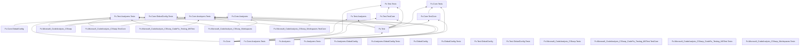

```mermaid
flowchart BT
	Fx.Core
	Fx.Core.TestCore
	Fx.Core.Tests
	Fx.Core.Analyzers
	Fx.Core.Analyzers.Tests
	Fx.Core.GlobalConfig
	Fx.Core.GlobalConfig.Tests
	Fx.Analyzers
	Fx.Analyzers.Tests
	Fx.Analyzers.GlobalConfig
	Fx.Analyzers.GlobalConfig.Tests
	Fx.GlobalConfig
	Fx.GlobalConfig.Tests
	Fx.Test
	Fx.Test.TestCore
	Fx.Test.Tests
	Fx.Test.Analyzers
	Fx.Test.Analyzers.Tests
	Fx.Test.GlobalConfig
	Fx.Test.GlobalConfig.Tests
	Fx.Microsoft_CodeAnalysis_CSharp
	Fx.Microsoft_CodeAnalysis_CSharp.TestCore
	Fx.Microsoft_CodeAnalysis_CSharp.Tests
	Fx.Microsoft_CodeAnalysis_CSharp_CodeFix_Testing_MSTest
	Fx.Microsoft_CodeAnalysis_CSharp_CodeFix_Testing_MSTest.TestCore
	Fx.Microsoft_CodeAnalysis_CSharp_CodeFix_Testing_MSTest.Tests
	Fx.Microsoft_CodeAnalysis_CSharp_Workspaces
	Fx.Microsoft_CodeAnalysis_CSharp_Workspaces.TestCore
	Fx.Microsoft_CodeAnalysis_CSharp_Workspaces.Tests

	Fx.Core --> Fx.Core.TestCore
	Fx.Test --> Fx.Core.TestCore

	Fx.Core --> Fx.Core.Tests
	Fx.Test --> Fx.Core.Tests
	Fx.Core.TestCore --> Fx.Core.Tests

	Fx.Core --> Fx.Core.Analyzers
	Fx.Microsoft_CodeAnalysis_CSharp --> Fx.Core.Analyzers
	Fx.Microsoft_CodeAnalysis_CSharp_Workspaces --> Fx.Core.Analyzers

	Fx.Core --> Fx.Core.Analzyers.Tests
	Fx.Test --> Fx.Core.Analzyers.Tests
	Fx.Microsoft_CodeAnalysis_CSharp --> Fx.Core.Analzyers.Tests
	Fx.Microsoft_CodeAnalysis_CSharp.TestCore --> Fx.Core.Analzyers.Tests
	Fx.Microsoft_CodeAnalysis_CSharp_CodeFix_Testing_MSTest --> Fx.Core.Analzyers.Tests
	Fx.Microsoft_CodeAnalysis_CSharp_Workspaces --> Fx.Core.Analzyers.Tests
	Fx.Microsoft_CodeAnalysis_CSharp_Workspaces.TestCore --> Fx.Core.Analzyers.Tests

	Fx.Core.GlobalConfig --> Fx.Core.GlobalConfig.Tests
	Fx.Test --> Fx.Core.GlobalConfig.Tests

	Fx.Core --> Fx.Test

	Fx.Core --> Fx.Test.TestCore
	Fx.Test --> Fx.Test.TestCore

	Fx.Core --> Fx.Test.Tests
	Fx.Test --> Fx.Test.Tests
	Fx.Test.TestCore --> Fx.Test.Tests

	Fx.Core --> Fx.Test.Analyzers
	Fx.Test --> Fx.Test.Analyzers

	Fx.Core --> Fx.Test.Analyzers.Tests
	Fx.Test --> Fx.Test.Analyzers.Tests
	Fx.Microsoft_CodeAnalysis_CSharp --> Fx.Test.Analyzers.Tests
	Fx.Microsoft_CodeAnalysis_CSharp.TestCore --> Fx.Test.Analyzers.Tests
	Fx.Microsoft_CodeAnalysis_CSharp_CodeFix_Testing_MSTest --> Fx.Test.Analyzers.Tests
	Fx.Microsoft_CodeAnalysis_CSharp_Workspaces --> Fx.Test.Analyzers.Tests
	Fx.Microsoft_CodeAnalysis_CSharp_Workspaces.TestCore --> Fx.Test.Analyzers.Tests
```
