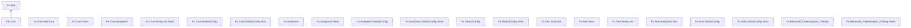

```mermaid
flowchart BT
	Fx.Core
	Fx.Core.TestCore
	Fx.Core.Tests
	Fx.Core.Analyzers
	Fx.Core.Analyzers.Tests
	Fx.Core.GlobalConfig
	Fx.Core.GlobalConfig.Test
	Fx.Analyzers
	Fx.Analyzers.Tests
	Fx.Analyzers.GlobalConfig
	Fx.Analyzers.GlobalConfig.Tests
	Fx.GlobalConfig
	Fx.GlobalConfig.Tests
	Fx.Test
	Fx.Test.TestCore
	Fx.Test.Tests
	Fx.Test.Analyzers
	Fx.Test.Analyzers.Test
	Fx.Test.GlobalConfig
	Fx.Test.GlobalConfig.Tests
	Fx.Microsoft_CodeAnalysis_CSharp
	Fx.Microsoft_CodeAnalysis_CSharp.Tests

	Fx.Core --> Fx.Test
```
